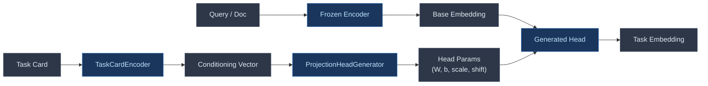

# Hydra

Hypernet-conditioned retrieval: per-task embedding adaptation without per-task fine-tuning.

## Motivation

General-purpose embedding models work reasonably well across domains, but specialized fine-tuning still wins on specific tasks. The problem is that fine-tuning doesn't scale — if you have dozens of retrieval tasks across different domains, query types, and relevance definitions, you can't afford to train and maintain a separate model for each.

Hydra solves this by training a **hypernet** that takes a task description (a "task card") and generates a lightweight projection head on the fly. The base encoder stays frozen. You describe what "relevance" means for your task, and Hydra compiles that into a task-specific embedding space.



## Architecture

### Teachers (`hydra/teachers/`)

An ensemble of retrieval methods provides training signal via Reciprocal Rank Fusion (RRF):

- **BM25** — lexical precision, handles jargon and exact matches
- **Dense bi-encoder** — semantic recall from a frozen sentence-transformer
- **Ensemble** — fuses teacher rankings via RRF, produces pairwise preferences

The key insight: distill *orderings*, not raw scores. Pairwise preferences are robust to teacher miscalibration.

### Hypernet (`hydra/hypernet/`)

- **TaskCard** — structured description of a retrieval task (description, example queries, example docs, domain, query type)
- **TaskCardEncoder** — encodes a task card into a fixed-size conditioning vector using a frozen sentence-transformer + learned projection
- **ProjectionHeadGenerator** — given a conditioning vector, generates the weights for a `384 -> 256` projection + learned LayerNorm parameters

The generated head is small (~100K params) and cheap to apply at inference time.

### Student (`hydra/student/`)

- **ConditionedRetriever** — end-to-end retriever that compiles a task card into a projection head, then encodes queries/docs through a frozen base encoder + the generated head

### Training (`hydra/training/`)

- **Pairwise margin loss** — log-sigmoid loss on (pos, neg) pairs, optionally weighted by teacher confidence
- **In-batch contrastive loss** — InfoNCE for additional signal
- **Trainer** — trains only the hypernet parameters (~500K) while keeping the base encoder frozen

### Evaluation (`hydra/eval/`)

Standard IR metrics: MRR@k, NDCG@k, Recall@k evaluated on BEIR datasets.

## Quick start

```bash
uv sync --dev
uv run python scripts/run_minimal_experiment.py
```

This will:
1. Download 3 small BEIR datasets (scifact, fiqa, nfcorpus)
2. Build BM25 + dense ensemble teachers and generate pairwise preferences
3. Train the hypernet on mixed-task preferences
4. Evaluate per-task retrieval quality (MRR@10, NDCG@10, Recall@100)

## Project structure

```
hydra/
├── teachers/
│   ├── bm25.py              # BM25Okapi wrapper
│   ├── dense.py             # Frozen bi-encoder teacher
│   └── ensemble.py          # RRF fusion of multiple teachers
├── hypernet/
│   ├── task_card.py          # Task description schema
│   ├── encoder.py            # Task card -> conditioning vector
│   └── head_generator.py     # Conditioning vector -> projection head weights
├── student/
│   └── conditioned_retriever.py  # Frozen encoder + generated head
├── data/
│   ├── beir_loader.py        # BEIR dataset loading + task card templates
│   └── preference_pairs.py   # Pairwise preference generation from teachers
├── training/
│   ├── pairwise_loss.py      # Margin and contrastive losses
│   └── trainer.py            # Training loop (hypernet params only)
└── eval/
    ├── metrics.py            # MRR, NDCG, Recall
    └── evaluator.py          # End-to-end retrieval evaluation
scripts/
└── run_minimal_experiment.py # Minimal multi-task experiment
```

## Development

```bash
uv sync --dev
uv run ruff check .          # lint
uv run ruff format .         # format
uv run pyright               # type check
```

## Design decisions

- **Frozen base encoder** — all-MiniLM-L6-v2 for prototyping, Nomic planned for later
- **Pairwise preference distillation** — robust to teacher miscalibration vs. raw score matching
- **Task cards over task IDs** — the hypernet should generalize to unseen tasks from their descriptions, not memorize a fixed task vocabulary
- **Small generated head** — a linear projection + LayerNorm is enough to rotate the embedding space per-task without overfitting
